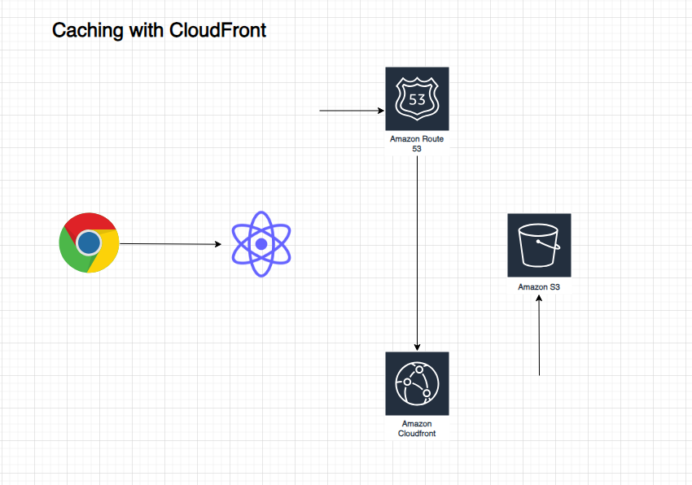

## Do you want to see all screenshots from this project? 
👉 [All screenshots](screenshots/)

### Want the full build journey with errors, fixes, lessons, and AWS tweaks?  
👉 [BUILD-JOURNAL.md](docs/BUILD-JOURNAL.md)

# 🌐 React App on AWS S3 with Static Hosting + CloudFront

This project demonstrates how to host a React application on AWS using S3 buckets for static website hosting and CloudFront for global content delivery. It includes HTTPS support, domain redirection, and caching optimizations.

**Diagram**



## 🚀 Project Overview

This setup allows you to:  
- Deploy a React app on AWS S3  
- Serve it globally via CloudFront with HTTPS  
- Redirect from `non-www` to `www` domain  
- Leverage Route 53 for DNS management  
- Optimize for speed and security

---

## 📦 Services Used

- **S3**: Static website hosting for React app  
- **CloudFront**: CDN for global distribution and HTTPS support  
- **Route 53**: Domain management and DNS routing  
- **Certificate Manager (ACM)**: SSL/TLS certificates for HTTPS  
- **React**: Frontend framework  

---

## 🛠️ Key Features

- Static site hosting for production React build  
- `cloudnecessities.com` redirects to `www.cloudnecessities.com`  
- HTTPS enabled via CloudFront and ACM  
- Fast content delivery using CloudFront caching  
- Bucket policies to control access  

---

## 📝 Setup Overview

1. **Created React App**  
   - Fixed PowerShell issues (`Set-ExecutionPolicy RemoteSigned`)  
   - Created app: `npx create-react-app demo-app`  
   - Built production bundle: `npm run build`  

2. **S3 Buckets**  
   - `www.cloudnecessities.com`: Hosts the site  
   - `cloudnecessities.com`: Redirects to `www`  

3. **Static Website Hosting**  
   - Enabled hosting and uploaded `build/` files to S3  
   - Configured bucket policy for public access  

4. **Route 53 DNS Setup**  
   - Added `A` records pointing to S3 buckets  
   - Managed domain redirection  

5. **CloudFront CDN**  
   - Configured distribution with SSL certificate from ACM  
   - Set HTTP → HTTPS redirection  

6. **Final Steps**  
   - Verified deployment and caching behavior  

---

## 📸 Screenshots

| React App Hosted on S3  | CloudFront Distribution | Route 53 DNS Setup |


**Screenshot:**


---

## 🗂️ Project Structure

```
/
├── demo-app/               # React App Source Code
├── docs/                   # Build journal (detailed steps)
│   └── BUILD-JOURNAL.md
├── screenshots/            # Key screenshots
├── README.md               # This file
```

---

## 📖 Detailed Build Journal

Want to see **step-by-step AWS setup?**  
📄 [Read the full build journal here »](docs/BUILD-JOURNAL.md)

---

## ⚡ Challenges Solved

- Fixed PowerShell `npx` execution policy errors on Windows  
- Configured S3 bucket policies for public access  
- Deployed ACM certificates for HTTPS via CloudFront  
- Debugged CloudFront caching and invalidation issues  

## 🧑‍💻 Author
👋 Milos Faktor 💼 [LinkedIn](https://www.linkedin.com/in/milos-faktor-78b429255/)

#AWS #CloudComputing #ReactJS #Serverless #S3 #CloudFront #StaticHosting #WebDevelopment #DevOps #Frontend #FullStack #CloudArchitecture
